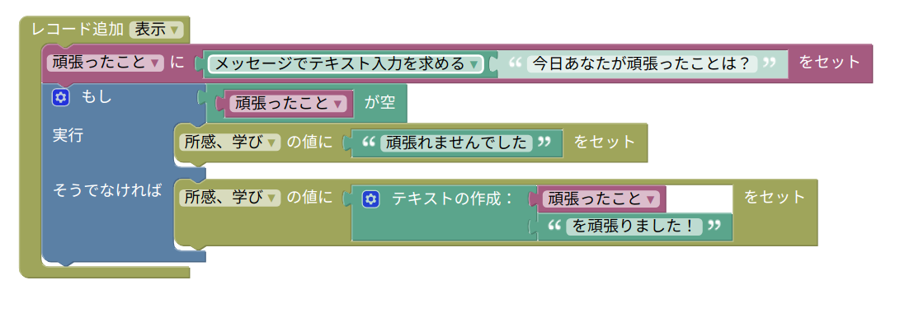
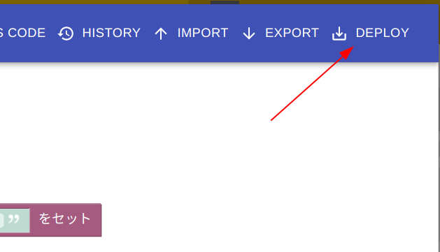

# KanariIi のはじめかた

このドキュメントでは KanariIi のインストールの仕方から基本的な利用の仕方を説明します。

- [インストール](#インストール)
- [KanariIi 開発環境を開く](#KanariIi_開発環境を開く)
- [プログラミング](#プログラミング)
- [プログラムのデプロイ](#プログラムのデプロイ)
- [開発に便利な機能](#開発に便利な機能)
    - [開発中のコードの確認](#開発中のコードの確認)
    - [変更のバージョン管理](#変更のバージョン管理)
    - [プログラムのインポートとエクスポート](#プログラムのインポートとエクスポート)

## インストール

[KanariIi - Chrome ウェブストア](https://chrome.google.com/webstore/detail/kanariii/ophmonkcolbmbicbacadjdobmbpidaop) にアクセスし KanariIi をインストールします。

KanariIi のインストール時には複数のWebサイト情報の読み取り、変更の権限を要求されますが、ここで表示されるサイトはすべて kintone を提供しているサイトのドメインです。**Add extension** ボタンをクリックすることでインストールされます。

インストールが正常に完了すると Chrome のブックマークバーの右側に下図のようなアイコンがグレーアウトで表示されます。

## KanariIi_開発環境を開く

KanariIi をインストールすると、アプリ管理権限を持っているアプリにアクセスしたときに KANARIII ボタンが出現します。

このボタンを押すと KanariIi 開発環境が開きます

## プログラミング

KanariIi ではプログラミングのエディタに [Blockly](https://developers.google.com/blockly) を採用しています。ブロックを組み立てることで kintone のカスタマイズを設計していきます。

ブロックは KanariIi 開発環境の左側のメニューをクリックすることで選択できます。 Kintone と書かれたボタンをクリックすると kintone 特有のブロックが表示されます。Blockly の基本的な使い方についてはここでは説明しませんが、ここからブロックを選んで組み立てていくことでプログラミングすることができます。

それでは試しにアプリのカスタマイズを作ってみましょう！

試しに kintone のアプリテンプレートから作れる「日報」アプリに対して以下のようなブロックを組み立ててみましょう。

作成する手順は以下のようになります。

1. イベントブロックの追加
    - `Kintone > イベント` から `レコード追加 表示` と書かれたブロックをドラッグする。
2. 変数 `頑張ったこと` を作成してダイアログから初期値を入れるようにする。
    - `Variables` を選択し、`変数の作成...` をクリックする。ダイアログで `新しい変数の名前` に `頑張ったこと` と入力する。
    - `Variables` の中に `頑張ったことに [] をセット` というブロックが作られるのでそのブロックを `レコード追加 表示` にセットする。
    - `Text` を選択し `メッセージでテキスト入力を求める` ブロックを `頑張ったことに [] をセット` の `[]` 部分にセットする。
    - `メッセージでテキスト入力を求める` ブロックに接続されている半透明のブロックに `今日あなたが頑張ったことは？` と入力する。
3. 条件分岐のブロックと判定条件(入力が空だった時)をセットする
    - `Logic` から `もし 実行` ブロックを選択し、2. で追加したのブロックの後につなげる。
    - 青い歯車マークをクリックすると小さなウインドウが開くので、`もし` ブロックの下に `そうでなければ` ブロックを追加する。
    - `Text` から `[] が空` ブロックを選択し `もし 実行` ブロックの一番上につなげる。
    - `Variables` から `頑張ったこと` ブロックを選択し `[] が空` ブロックの `[]` 部分にセットする。
4. 条件が真だったときに `所感、学び` に初期値をセットする
   - `Kintone > レコード` から `[レコード番号] の値に [] をセット` を `もし 実行` ブロックの真ん中のくぼみにセットする。
   - `[レコード番号] の値に [] をセット` の `[レコード番号]` をクリックし `所感、学び` を選択する。
   - `Text` から `"[]"` ブロックを `[レコード番号] の値に [] をセット` の `[]` 部分にセットする。
   - `"[]"` ブロックに `頑張れませんでした` を入力する。
5. 条件が偽だったときに `所感、学び` に初期値をセットする
   - `Kintone > レコード` から `[レコード番号] の値に [] をセット` を `もし 実行` ブロックの真ん中のくぼみにセットする。
   - `[レコード番号] の値に [] をセット` の `[レコード番号]` をクリックし `所感、学び` を選択する。
   - `Text` から `テキストの作成` ブロックを `[レコード番号] の値に [] をセット` の `[]` 部分にセットする。
   - `テキストの作成` ブロックの歯車をクリックし、小さなウインドウの中の `結合` ブロックの中に二つ `項目` ブロックをセットします。
   - `テキストの作成` ブロックに `Variables` の `頑張ったこと` ブロックと `Text` から `"[]"` ブロックをセットします。
   - `"[]"` ブロックに `を頑張りました！` と入力します。

お疲れ様でした！これで、最初に提示したようなブロックが組み上がったはずです。

## プログラムのデプロイ

それではこのプログラムをアプリにデプロイしてみましょう。

ウインドウの右上の DEPLOY ボタンを押します。

するとデプロイする時のメッセージの入力を促されます。特にコメントがなければそのままで構いません。

その後、`TAKE OFF!` ボタンをクリックするとアプリがデプロイされます。

デプロイが完了したら早速、アプリのレコードの追加画面を表示してみましょう。

プログラムされたとおり、ダイアログが表示されますね！

何か入力してみましょう。

`所感、学び` に値がセットされました！

以上が KanariIi の開発の基本的な流れです。ぜひ、楽しんでいろいろなプログラミングを作ってみてください！

## 開発に便利な機能

ここでは KanariIi の開発に便利な機能を紹介します。

### 開発中のコードの確認

KanariIi のブロックは最終的に JavaScript に変換されて kintone にデプロイされます。この時、どのような JavaScript に変換されるかは `JS CODE` というボタンを押すことで確認することができます。

ただし図で赤線を引いたように、日本語の変数名や関数名はわかりにくい文字の羅列に変換されてしまいます。もし JavaScript を人が読める状態に保ちたい時は、変数名や関数名をアルファベットだけで書くことをオススメします。

`COPY` ボタンを押すことで雛形だけ KanariIi で作成し、続きの開発を通常通り JavaScript で開発を進めることもできます。

### 変更のバージョン管理

開発を進める中で、時には「あ、これはさっきの修正に戻したいな」というときもあるでしょう。そういう時は `HISTORY` ボタンを押してみましょう。

以前のバージョンが Deploy Message とともに一覧で表示されますので、好きなバージョンを選択して戻すことができます。

### プログラムのインポートとエクスポート

開発を進める中で、時には「あ、このプログラムを別のアプリにも適用したいな」というときもあるでしょう。そういう時には、`EXPORT` ボタンを押してみましょう。

XML または JavaScript の形式でプログラムをダウンロードすることができます。

そして、ダウンロードされた XML は KanariIi の `IMPORT` ボタンを押すことでインポートすることができます。

JavaScript は kintone の `JavaScript / CSSでカスタマイズ` からアップロードできます。
